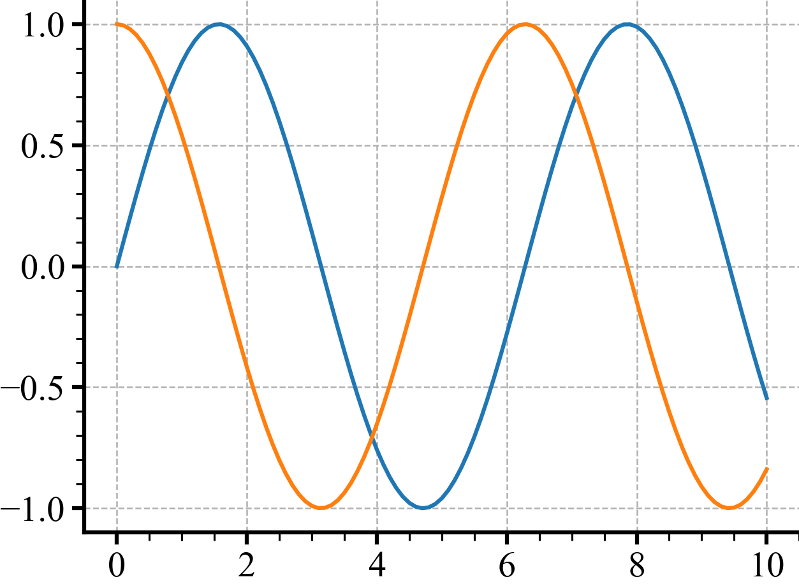

# How to debug in pycharm

For Ram

Before you start, make sure that you
1. Download JetBrains Toolbox
2. Download PyCharm

Then you can run this with debug mode on to
- [ ] Introduce a bug
- [ ] use the debugger to fix it.

```python
from pathlib import Path
import torch
import numpy as np
import matplotlib.pyplot as plt

x = torch.linspace(0, 10, 101)
y = x.sin()
y2 = torch.sin(x + 0.5 * np.pi)
```
| **$sin(x)$** | **$sin(x)$ and $sin(x+\frac 1 2 \pi)$** |
|:------------:|:---------------------------------------:|
|  |  |
