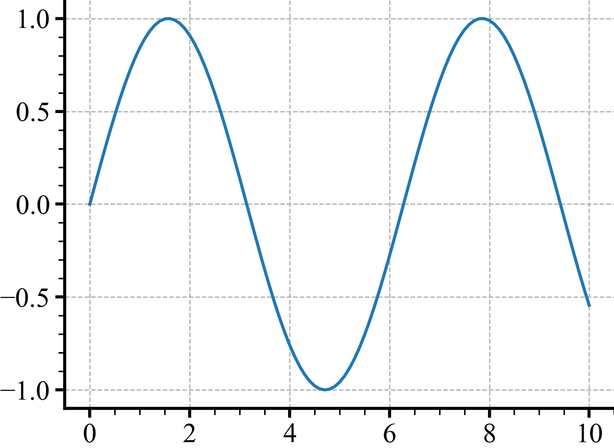
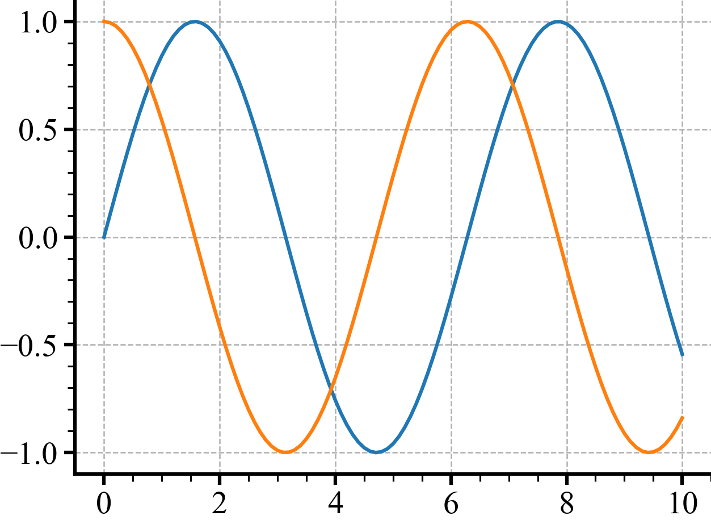

# How to debug in pycharm

For Ram

```python
from pathlib import Path
import torch
import numpy as np
import matplotlib.pyplot as plt

x = torch.linspace(0, 10, 101)
y = x.sin()
y2 = torch.sin(x + 0.5 * np.pi)
```
| **$sin(x)$** | **$sin(x)$ and $sin(x+\frac 1 2 \pi)$** |
|:------------:|:---------------------------------------:|
|  |  |
